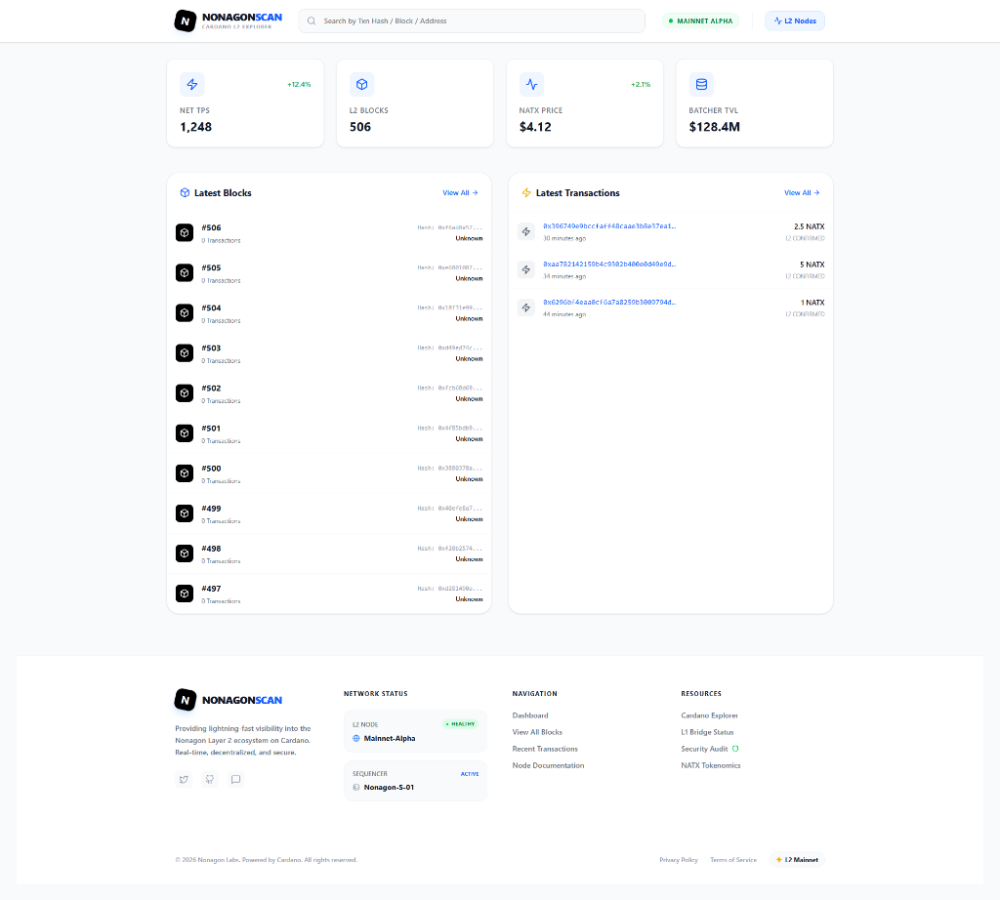

# Nonagon Blockchain

> **Layer-2 Scaling Solution for Cardano**

[](LICENSE)
[]()

**Nonagon** is a high-performance Layer-2 blockchain that settles to Cardano mainnet. It combines the speed of optimistic rollups with the security of Cardano's proof-of-stake consensus.

---

## 🎯 Overview

| Property | Value |
|----------|-------|
| **Native Asset** | NATX |
| **Target TPS** | 1,000+ |
| **Block Time** | 1 second |
| **Settlement Layer** | Cardano L1 |
| **Rollup Type** | Optimistic (Interactive Fraud Proofs) |
| **VM** | EVM-compatible |
| **Address Format** | Cardano-compatible (addr1...) |

---



## 📁 Project Structure

```
nonagon/
├── nonagon-node/          # C++ L2 node implementation
│   ├── include/nonagon/   # Header files
│   │   ├── types.hpp      # Core types (Block, Transaction, Address)
│   │   ├── crypto.hpp     # Blake2b, Ed25519, Bech32
│   │   ├── storage.hpp    # RocksDB, Merkle Patricia Trie
│   │   ├── execution.hpp  # EVM, gas model, transaction processor
│   │   ├── consensus.hpp  # Rotating Sequencer Set, mempool
│   │   ├── settlement.hpp # Cardano bridge, batch builder
│   │   ├── network.hpp    # P2P, peer discovery, sync
│   │   ├── rpc.hpp        # JSON-RPC server (eth_*, nonagon_*)
│   │   └── node.hpp       # Main node orchestrator
│   ├── src/               # Implementation files
│   └── CMakeLists.txt     # Build configuration
├── explorer/              # React/TypeScript block explorer
│   ├── src/components/    # Dashboard, BlockView, TxView
│   └── package.json
├── wallet/                # React/TypeScript wallet application
│   ├── src/components/    # Dashboard, Send, Receive
│   └── package.json
└── README.md
```

---

## 🏗️ Architecture

### Transaction Lifecycle

```
┌─────────────┐    ┌──────────┐    ┌───────────┐    ┌──────────────┐
│   Wallet    │───►│ RPC Node │───►│  Mempool  │───►│  Sequencer   │
└─────────────┘    └──────────┘    └───────────┘    └──────────────┘
                                                            │
                                        ┌───────────────────┘
                                        ▼
                              ┌──────────────────┐
                              │ Block Production │
                              └──────────────────┘
                                        │
                        ┌───────────────┼───────────────┐
                        ▼               ▼               ▼
                  ┌──────────┐   ┌──────────┐   ┌──────────────┐
                  │ L2 State │   │  Batch   │   │   Cardano    │
                  │  Update  │   │ Builder  │   │  Settlement  │
                  └──────────┘   └──────────┘   └──────────────┘
```

### Settlement on Cardano

1. **Batch Aggregation**: Sequencer bundles L2 blocks every ~1 hour
2. **State Commitment**: Merkle root of state transitions posted to Plutus contract
3. **Challenge Period**: 7-day window for fraud proofs
4. **Finalization**: Batch becomes final after unchallenged period

---

## 🚀 Quick Start

### Prerequisites

- CMake 3.20+
- C++20 compiler (GCC 11+, Clang 14+, MSVC 2022)
- Node.js 18+
- RocksDB (optional, falls back to in-memory)

### Build Node

```bash
cd nonagon-node
mkdir build && cd build
cmake ..
cmake --build .
```

### Run Node

```bash
./nonagon-node --config config.toml --data-dir ./data
```

### Run Explorer

```bash
cd explorer
npm install
npm run dev
```

### Run Wallet

```bash
cd wallet
npm install
npm run dev
```

---

## 🔧 Configuration

### Node Configuration (config.toml)

```toml
[node]
name = "nonagon-node-1"
data_dir = "./data"
chain_id = 1

[network]
listen_port = 30303
max_peers = 50

[rpc]
http_port = 8545
ws_port = 8546

[consensus]
block_time_ms = 1000
max_sequencers = 21
min_stake = 100000

[settlement]
cardano_node = "/path/to/cardano-node/socket"
state_contract = "script_hash_abc123..."
challenge_period_seconds = 604800
```

---

## 📡 JSON-RPC API

### Ethereum-Compatible Endpoints

| Method | Description |
|--------|-------------|
| `eth_chainId` | Get chain ID |
| `eth_blockNumber` | Get latest block number |
| `eth_getBalance` | Get account balance |
| `eth_sendRawTransaction` | Submit signed transaction |
| `eth_call` | Call contract (read-only) |
| `eth_estimateGas` | Estimate gas for transaction |
| `eth_getTransactionReceipt` | Get transaction result |

### Nonagon-Specific Endpoints

| Method | Description |
|--------|-------------|
| `nonagon_getBatch` | Get settlement batch details |
| `nonagon_getL1FinalizedBlock` | Get latest L1-finalized block |
| `nonagon_getSequencerSet` | Get active sequencer list |
| `nonagon_getDepositStatus` | Check bridge deposit status |
| `nonagon_getWithdrawalStatus` | Check bridge withdrawal status |

---

## 🔐 Security Model

### Optimistic Rollup Security

- **Data Availability**: Transaction data posted to Cardano
- **Fraud Proofs**: Interactive bisection protocol
- **Challenge Period**: 7-day dispute window
- **Sequencer Bond**: 500,000 NATX minimum stake

### Slashing Conditions

| Offense | Slash Amount |
|---------|--------------|
| Double signing | 5% of stake |
| Invalid state transition | 100% of stake |
| Prolonged unavailability | 0.1% per day |

---

## 🌉 Bridge Operations

### Deposit (L1 → L2)

1. Lock ADA/tokens on Cardano Plutus contract
2. Wait for confirmation (2 Cardano blocks)
3. Receive wrapped tokens on L2 (nADA, nUSDC, etc.)

### Withdrawal (L2 → L1)

1. Burn wrapped tokens on L2
2. Wait for batch settlement + challenge period (~7 days)
3. Claim original tokens on Cardano

---

## 📊 Gas Model (EIP-1559)

| Parameter | Value |
|-----------|-------|
| Block Gas Limit | 30,000,000 |
| Target Gas | 15,000,000 (50%) |
| Base Fee Adjustment | ±12.5% per block |
| Min Priority Fee | 1 Gwei |

### Fee Distribution

- **50%** to sequencer
- **30%** burned (deflationary)
- **20%** to protocol treasury

---

## 🧪 Testing

```bash
# Unit tests
cd nonagon-node/build
ctest --output-on-failure

# Integration tests
./integration_tests.sh

# Explorer tests
cd explorer && npm test

# Wallet tests
cd wallet && npm test
```

---

## 📅 Roadmap

### Phase 1: Foundation (Months 1-6) ✅
- [x] Core node architecture
- [x] Basic consensus
- [x] Storage layer
- [x] Internal devnet

### Phase 2: Settlement (Months 7-12)
- [ ] Cardano Plutus contracts
- [x] Batch submission
- [ ] Fraud proof system
- [ ] Bridge contracts

### Phase 3: Execution (Months 13-18)
- [x] Full EVM integration
- [x] Gas model
- [x] RPC API
- [ ] Public testnet

### Phase 4: User Interfaces (Months 19-24)
- [ ] Production wallet
- [x] Block explorer
- [ ] Bridge UI
- [x] Documentation

### Phase 5: Mainnet (Months 25-30)
- [ ] Security audits
- [ ] Incentivized testnet
- [ ] Mainnet launch

---

## 🤝 Contributing

We welcome contributions! Please see [CONTRIBUTING.md](CONTRIBUTING.md) for guidelines.

---

## 📄 License

MIT License - see [LICENSE](LICENSE) for details.

---

## 📞 Contact

- **Website**: https://nonagon.io
- **Twitter**: @NonagonL2
- **Discord**: discord.gg/nonagon
- **Email**: team@nonagon.io

---

*Built with ❤️ for Cardano*